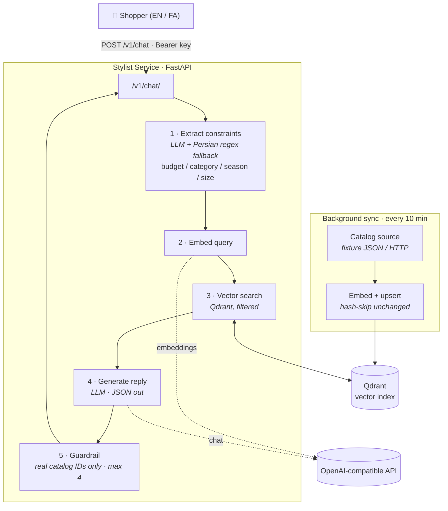

<h1 align="center">LUMIO Personal Stylist — RAG Service</h1>

<p align="center">
  A bilingual (English / Farsi) retrieval-augmented stylist that recommends
  <b>only real, in-stock products</b> from a fashion catalog.
</p>

<p align="center">
  
  
  
  
</p>

---

## What it is

A standalone service that owns a **Qdrant vector index** over a product catalog and
answers shopper questions over `POST /v1/chat` behind a bearer key. It extracts hard
constraints (budget, category, season, size) from the message, retrieves matching
products by semantic similarity, and has an LLM write a natural reply in the shopper's
language — **grounded strictly in the retrieved catalog items**.

Design goals it enforces:

- **No hallucinated products.** The reply may only reference IDs that came back from the
  vector search; anything else is stripped before responding (max 4 items).
- **Honesty over helpfulness.** If nothing fits (e.g. a budget too low), it says so
  instead of inventing options.
- **Bilingual.** Handles English and Farsi input/output, including Persian digits and
  budget phrasing (`زیر ۳ میلیون تومان` → `3,000,000`).
- **Backend-agnostic.** Any OpenAI-compatible endpoint — hosted OpenAI by default, or a
  local Ollama with a one-block env change.

## How it works



## Stack

| Concern | Choice |
|---|---|
| API | FastAPI + Uvicorn |
| LLM + embeddings | Any OpenAI-compatible endpoint — defaults to `gpt-4o-mini` + `text-embedding-3-small` (1536-dim) |
| Vector store | Qdrant — **embedded on-disk** by default (no Docker); or a Qdrant server via `QDRANT_URL` |
| Scheduler | APScheduler (periodic catalog re-sync) |
| Config | pydantic-settings (`.env`) |

## Quickstart

```bash
git clone <your-fork-url> lumio-stylist-rag
cd lumio-stylist-rag

python -m venv .venv
source .venv/bin/activate        # Windows: .venv\Scripts\activate

pip install -r requirements.txt
cp .env.example .env             # then set LLM_API_KEY / EMBED_API_KEY + the two shared secrets
```

Minimum you must fill in `.env`:

```ini
LLM_API_KEY=sk-...
EMBED_API_KEY=sk-...
STYLIST_API_KEY=<any-strong-secret>   # bearer key clients must send
```

### Run

```bash
uvicorn app.main:app --port 8010
```

On startup the service creates the collection, indexes the catalog from the bundled
fixture, and schedules a re-sync every `SYNC_INTERVAL_MINUTES`.

## Endpoints

| Method | Path | Auth | Purpose |
|---|---|---|---|
| `GET` | `/healthz` | none | `{ status, indexedProducts, model }` |
| `POST` | `/v1/chat` | `Bearer STYLIST_API_KEY` | chat contract |
| `POST` | `/admin/reindex` | `Bearer STYLIST_API_KEY` | force a full re-embed |

```bash
curl -s localhost:8010/healthz

curl -s localhost:8010/v1/chat \
  -H "Authorization: Bearer $STYLIST_API_KEY" \
  -H 'Content-Type: application/json' \
  -d '{"message":"a dress for a summer wedding under 3,000,000 Toman","lang":"en","history":[]}'
```

<details>
<summary>Example response</summary>

```json
{
  "reply": "I recommend the Ivory Silk Midi Dress (2,890,000 Toman) ...",
  "productIds": ["ivory-silk-midi-dress", "blush-satin-slip-dress"],
  "followUps": ["What accessories would go well with these?", "..."]
}
```
</details>

> **Tip:** test Farsi through a real HTTP client (the website proxy, `httpx`, Postman).
> Sending Persian JSON via a Windows shell's inline `curl -d` can mangle the UTF-8 bytes.

## Configuration

All settings come from environment / `.env` — see [`.env.example`](.env.example). Key ones:

| Var | Default | Notes |
|---|---|---|
| `LLM_*` / `EMBED_*` | OpenAI | base URL, key, model; embeddings drive `EMBED_DIM` |
| `EMBED_DIM` | `1536` | must match the embedding model (e.g. `1024` for `bge-m3`) |
| `QDRANT_URL` | *(empty)* | empty = embedded on-disk at `QDRANT_LOCAL_PATH`; set it to use a server |
| `CATALOG_SOURCE` | `fixture` | `fixture` = bundled JSON; `http` = pull from the website |
| `STYLIST_API_KEY` | — | bearer key required on `/v1/chat` and `/admin/reindex` |
| `SYNC_INTERVAL_MINUTES` | `10` | background re-sync cadence |

## Catalog source

- **`fixture`** (default) reads [`scripts/dev_catalog_fixture.json`](scripts/dev_catalog_fixture.json)
  — full standalone dev, nothing else to run. This file is committed.
- **`http`** pulls from `${LUMIO_BASE_URL}/api/stylist/catalog` using `STYLIST_SYNC_SECRET`.
  This requires the website's catalog route, which is a **later web-integration phase**.

To refresh the fixture from a LUMIO monorepo checkout:

```bash
SEED_PATH=/path/to/lumio/web/prisma/seed.ts python scripts/make_fixture.py
```

## Tests

```bash
# with the server running on :8010
python scripts/smoke.py
```

Covers: health, auth (401 / 422), EN + FA filtered retrieval, budget honesty
("nothing fits"), and the off-catalog-id injection guardrail.

## Switching to local Ollama (offline)

```ini
LLM_BASE_URL=http://localhost:11434/v1    LLM_API_KEY=ollama   LLM_MODEL=qwen2.5:7b
EMBED_BASE_URL=http://localhost:11434/v1  EMBED_API_KEY=ollama EMBED_MODEL=bge-m3   EMBED_DIM=1024
```

Changing the embedding model changes the vector size — delete `qdrant_data/` and let it reindex.

## Docker

```bash
docker build -t lumio-stylist .
docker run -p 8010:8010 --env-file .env lumio-stylist
```

For production, run Qdrant as its own container/app with a persistent volume, set
`QDRANT_URL`, and keep the service's port private — only the website should reach it.

## Project structure

```
app/
  main.py         FastAPI app: routes, auth, startup sync, scheduler
  pipeline.py     orchestration: constraints → retrieve → generate → guardrail
  retrieval.py    constraint extraction + filtered Qdrant search
  generation.py   stylist prompt, JSON output, injection guardrails
  indexer.py      embed + upsert, hash-skip, delete-stale
  catalog.py      catalog source (fixture / http)
  persian.py      Persian digit + budget normalization
  clients.py      OpenAI + Qdrant clients
  config.py       env-backed settings
  models.py       pydantic request/response + catalog models
scripts/
  dev_catalog_fixture.json   bundled dev catalog (committed)
  make_fixture.py            regenerate the fixture from a monorepo seed
  smoke.py                   end-to-end smoke tests
```

## Roadmap

- **Web integration (deferred):** the website's `GET /api/stylist/catalog` route, a chat
  proxy, and the storefront UI. Once the catalog route exists, flip `CATALOG_SOURCE=http`
  — the sync client is already implemented.

---

